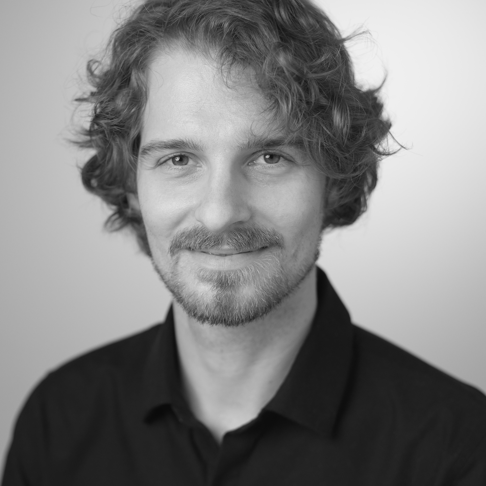
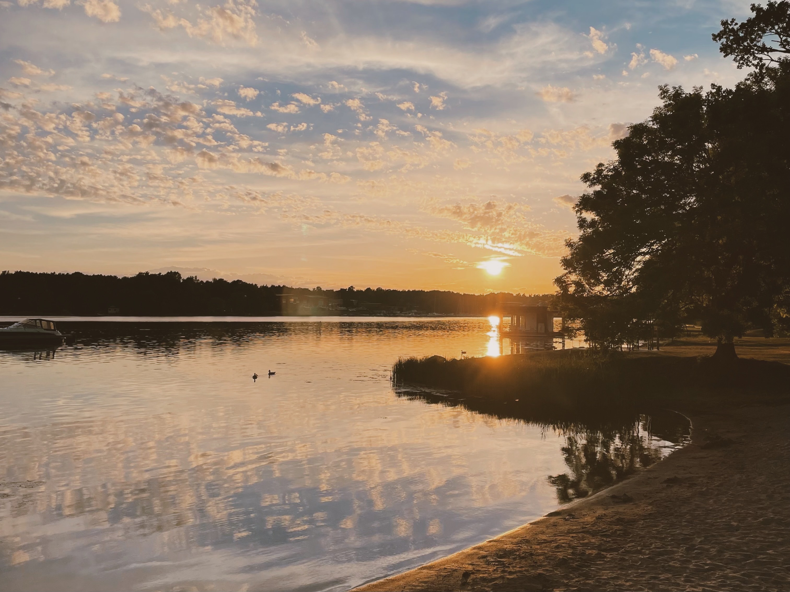
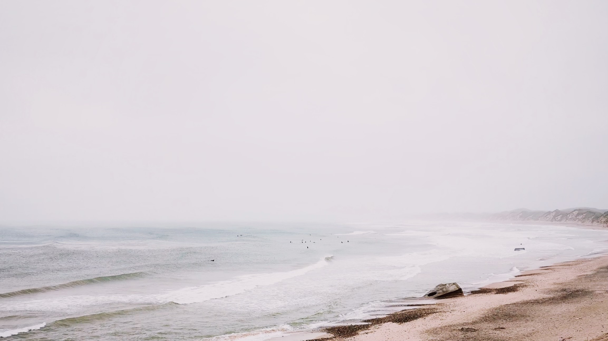
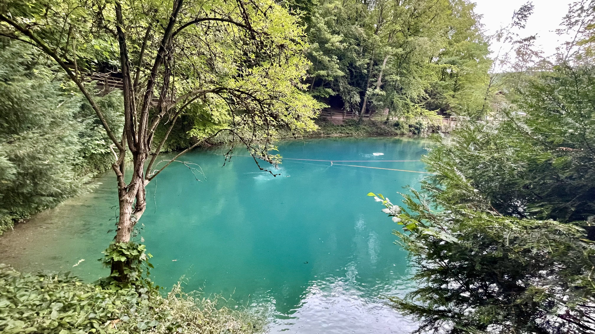
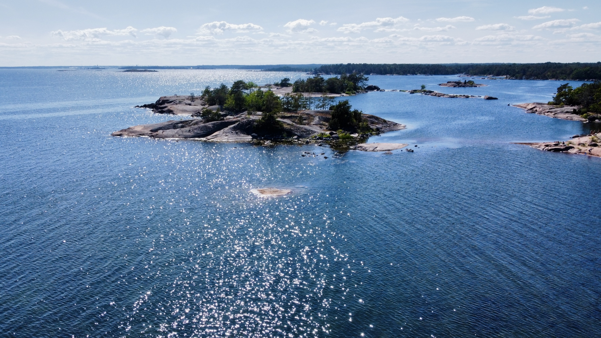
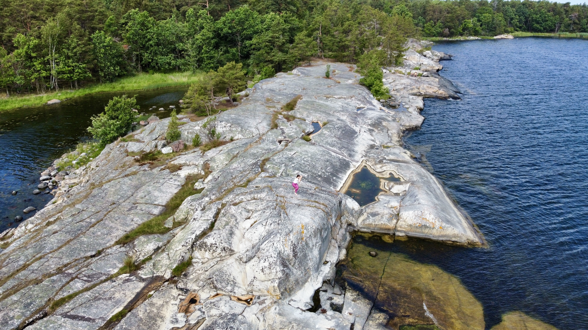
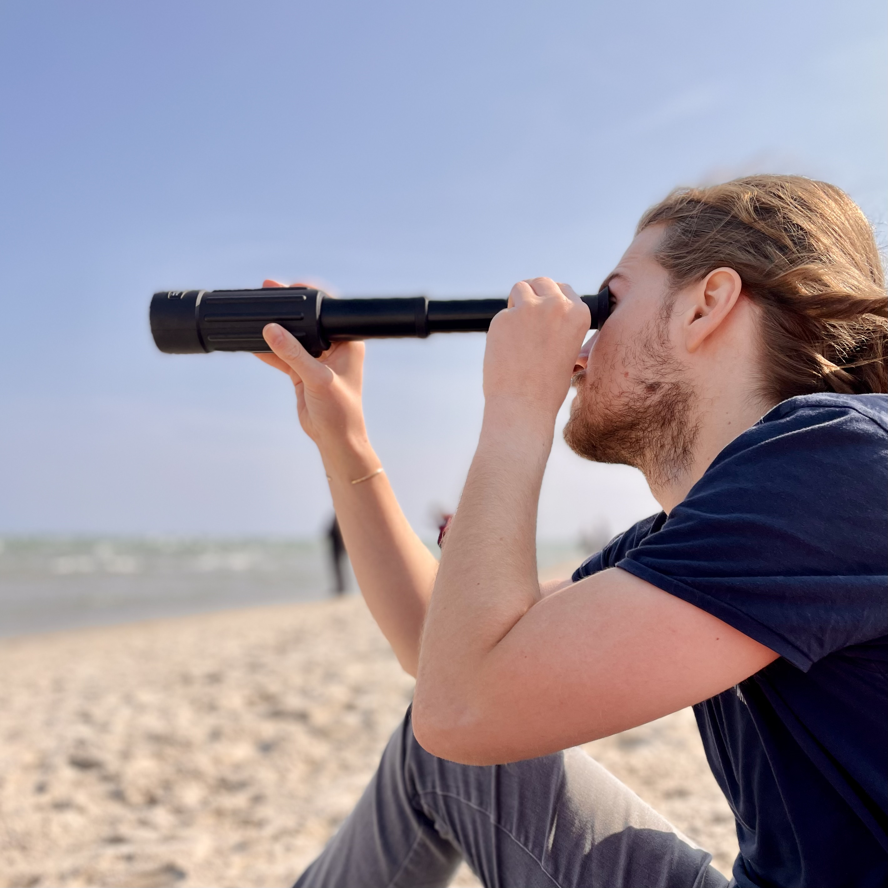
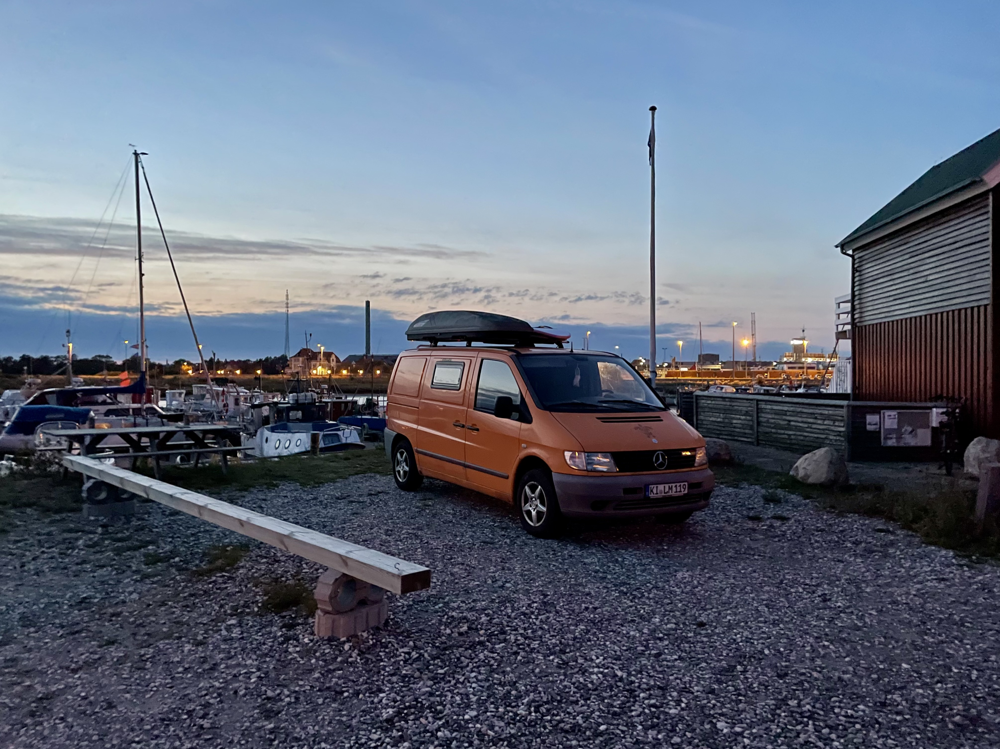
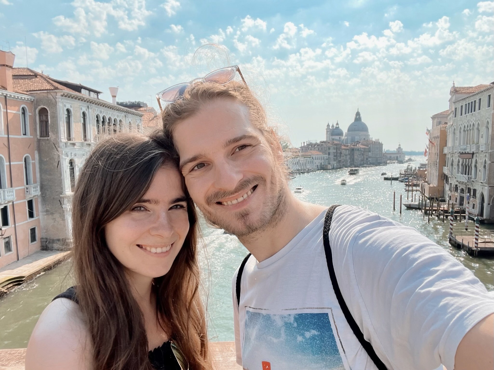
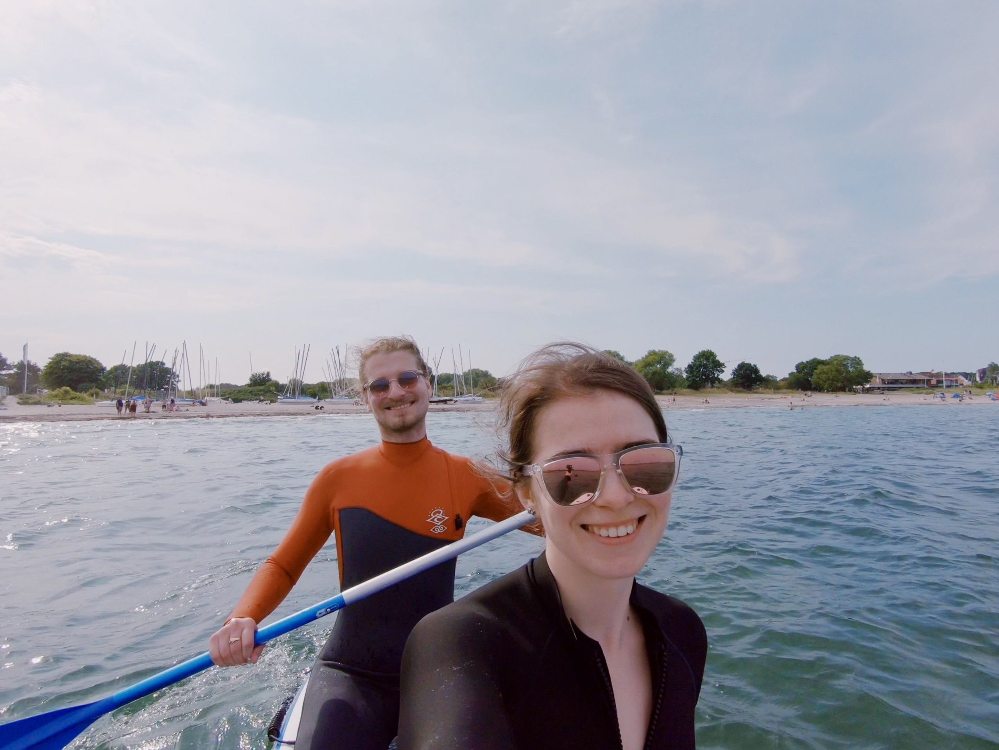

 <figure style="display: inline-block; margin: 0; max-width: 256px">

<figcaption style="text-align: center; font-weight: 100;">Lukas Galke (Photo: <a href="https://www.instagram.com/paulgeorggalke/">paulgeorggalke</a>)</figcaption>
</figure>

## Bio

Lukas Galke Poech is an Assistant Professor in the Department of Mathematics and Computer Science at the University of Southern Denmark. His research focuses on advancing AI safety through interpretability. He is the principal investigator of the MIST Project on Scalable Mechanistic Interpretability for Safe and Trustworthy Language Model Agents, supported by the Novo Nordisk Foundation. Lukas received his PhD in representation learning from Kiel University, Germany. He then joined the Max Planck Institute for Psycholinguistics as a postdoc, where he drew inspiration from research on how language works in the human brain to understand learning, behavior, and cognition in language models. His work has been published in venues including Neural Networks and Nature Communications.

## Profiles

- ORCID: [0000-0001-6124-1092](https://orcid.org/0000-0001-6124-1092)
- DBLP: [Lukas Galke](https://dblp.org/pid/200/7830.html)
- Google Scholar: [Lukas Galke](https://scholar.google.de/citations?hl=en&pli=1&user=AHGGdYQAAAAJ)
- GitHub: [lgalke](https://github.com/lgalke)
- Mastodon: [@lpag@sigmoid.social](https://sigmoid.social/@lpag)
- LinkedIn: [Lukas Galke](https://www.linkedin.com/in/lukas-galke-8086b0155/)
- BlueSky: [@lukasgalke.bsky.social](https://bsky.app/profile/lukasgalke.bsky.social)
- X (inactive): [@LukasGalke](https://x.com/LukasGalke)

## Get to know me

- I am motivated by challenges.
- I practice Yoga.
- I like to go surfing and stand-up paddling.
- I like reading.  Current book recommendations: *The Light Pirate* by Lily Brooks-Dalton, *Station 11* by Emily St. John Mandel.
- I like to play chess. 
- I like photography, sometimes with drones.
- I make music. I play Saxophone since childhood, but only at Christmas these days. I am learning to play Ukulele (on hold).

## Some photos

